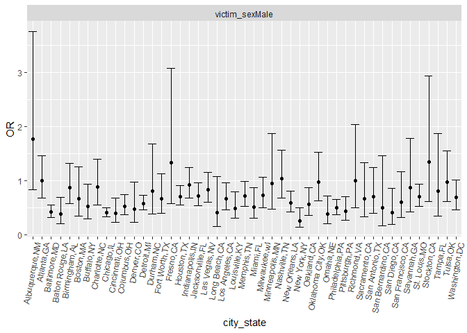

p8105_yh3555_hw6
================
Yuchen Hua
2022-11-28

## Problem 2

Import data

``` r
homicide = read.csv("./data./homicide-data.csv")
```

Date cleaning

``` r
homicide_clean = homicide %>%
  mutate(city_state = str_c(city, ",", state)) %>%
  mutate(city_state = as.factor(city_state)) %>%
  mutate(victim_age = as.numeric(victim_age)) %>%
  group_by(city_state, disposition) %>% 
  filter(!city_state %in% c("Dallas,TX", "Phoenix,AZ", "Kansas City,MO", "Tulsa,AL"),
         !victim_age %in% c(NA),
         !victim_sex %in% c("Unknown")) %>%
  filter(victim_race %in% c("Black", "White")) %>%
  mutate(resolved = ifelse(disposition %in% c("Closed by arrest"), 1, 0)) %>%
  select(-uid, -reported_date, -victim_last, -victim_first, -lat, -lon)
```

    ## Warning in mask$eval_all_mutate(quo): 强制改变过程中产生了NA

``` r
homicide_clean
```

    ## # A tibble: 39,362 × 8
    ## # Groups:   city_state, disposition [135]
    ##    victim_race victim_age victim_sex city        state disposi…¹ city_…² resol…³
    ##    <chr>            <dbl> <chr>      <chr>       <chr> <chr>     <fct>     <dbl>
    ##  1 White               15 Female     Albuquerque NM    Closed w… Albuqu…       0
    ##  2 White               72 Female     Albuquerque NM    Closed w… Albuqu…       0
    ##  3 White               91 Female     Albuquerque NM    Open/No … Albuqu…       0
    ##  4 White               56 Male       Albuquerque NM    Open/No … Albuqu…       0
    ##  5 White               43 Female     Albuquerque NM    Closed b… Albuqu…       1
    ##  6 White               52 Male       Albuquerque NM    Closed b… Albuqu…       1
    ##  7 White               22 Female     Albuquerque NM    Closed b… Albuqu…       1
    ##  8 Black               15 Male       Albuquerque NM    Closed b… Albuqu…       1
    ##  9 Black               25 Male       Albuquerque NM    Closed b… Albuqu…       1
    ## 10 White               20 Male       Albuquerque NM    Closed b… Albuqu…       1
    ## # … with 39,352 more rows, and abbreviated variable names ¹​disposition,
    ## #   ²​city_state, ³​resolved

If the case was closed by arrested, which was solved, it would be
labelled as 1. If Open/No arrest or Closed without arrest, it would be
labelled as 0.

For Baltimore,MD

``` r
baltimore_fit = homicide_clean %>%
  filter(city_state %in% c("Baltimore,MD")) %>%
  glm(resolved ~ victim_age + victim_race + victim_sex, data = ., family = binomial())
baltimore_fit
```

    ## 
    ## Call:  glm(formula = resolved ~ victim_age + victim_race + victim_sex, 
    ##     family = binomial(), data = .)
    ## 
    ## Coefficients:
    ##      (Intercept)        victim_age  victim_raceWhite    victim_sexMale  
    ##         0.309981         -0.006727          0.841756         -0.854463  
    ## 
    ## Degrees of Freedom: 2752 Total (i.e. Null);  2749 Residual
    ## Null Deviance:       3568 
    ## Residual Deviance: 3493  AIC: 3501

``` r
baltimore_tidy = broom::tidy(baltimore_fit)
```

The OR and CI of baltimore can be obtained.

``` r
baltimore_tidy %>%
  mutate(OR = exp(estimate),
         ci_lower = exp(estimate - 1.96*std.error),
         ci_upper = exp(estimate + 1.96*std.error)) %>%
  filter(term %in% c("victim_sexMale")) %>%
  select(term, log_OR = estimate, OR, ci_lower, ci_upper) %>%
  knitr::kable(digits = 3)
```

| term           | log_OR |    OR | ci_lower | ci_upper |
|:---------------|-------:|------:|---------:|---------:|
| victim_sexMale | -0.854 | 0.426 |    0.325 |    0.558 |

For all cities

``` r
nest_city = homicide_clean %>%
  nest(data = -city_state) %>%
  mutate(
    models = map(data, ~glm(resolved ~ victim_age + victim_race + victim_sex, data= ., family = binomial())),
    results = map(models, broom::tidy)) %>%
  select(-data, -models) %>%
  unnest(results) %>%
  filter(term %in% c("victim_sexMale")) %>%
  filter(term != "(Intercept)") %>%
  select(city_state, term, estimate, std.error)
```

OR an CI

``` r
city_data = nest_city %>%
   mutate(OR = exp(estimate),
         ci_lower = exp(estimate - 1.96*std.error),
         ci_upper = exp(estimate + 1.96*std.error)) %>%
  select(term, log_OR = estimate, OR, ci_lower, ci_upper)
```

    ## Adding missing grouping variables: `city_state`

building plot

``` r
city_data %>% 
  mutate(city_state = fct_reorder(city_state, OR)) %>%
  ggplot(aes(x = city_state, y = OR)) +
  geom_point() +
  geom_errorbar(aes(ymin = ci_lower, ymax= ci_upper)) +
  facet_wrap(~term) + 
  theme(axis.text.x = element_text(angle = 80, hjust = 1))
```

<!-- -->

## Problem 3

``` r
bw = read.csv("./data/birthweight.csv")
```

Let’s

``` r
bw_tidy = bw %>%
  filter(!bwt %in% c(NA),
         !momage %in% c(NA),
         !delwt %in% c(NA),
         !blength %in% c(NA),
         !fincome %in% c(NA),
         !gaweeks %in% c(NA),
         !menarche %in% c(NA),
         !mheight %in% c(NA),
         !parity %in% c(NA),
         !pnumlbw %in% c(NA),
         !pnumsga %in% c(NA),
         !ppbmi %in% c(NA),
         !ppwt %in% c(NA),
         !smoken %in% c(NA),
         !wtgain %in% c(NA)) %>%
  
  mutate(babysex = as.factor(babysex),
         malform = as.factor(malform),
         mrace = as.factor(mrace),
         frace = as.factor(frace),
         id = 1:nrow(bw))
```

Let’s hypothesize that the birthweight has a linear regression
relationship with head circumference, mother’s weight at delivery,
average number of cigarettes smoked per day during pregancy, weight
gained during pregnancy. Let’s build models.

``` r
mod1_lm = lm(bwt ~ blength + delwt + smoken + wtgain, data = bw_tidy)
summary(mod1_lm)
```

    ## 
    ## Call:
    ## lm(formula = bwt ~ blength + delwt + smoken + wtgain, data = bw_tidy)
    ## 
    ## Residuals:
    ##     Min      1Q  Median      3Q     Max 
    ## -1696.8  -219.2    -6.3   209.5  4297.9 
    ## 
    ## Coefficients:
    ##               Estimate Std. Error t value Pr(>|t|)    
    ## (Intercept) -3872.6958    95.1897 -40.684  < 2e-16 ***
    ## blength       132.5746     1.9348  68.520  < 2e-16 ***
    ## delwt           2.2489     0.2568   8.757  < 2e-16 ***
    ## smoken         -2.4925     0.6893  -3.616 0.000303 ***
    ## wtgain          3.3692     0.5161   6.529 7.41e-11 ***
    ## ---
    ## Signif. codes:  0 '***' 0.001 '**' 0.01 '*' 0.05 '.' 0.1 ' ' 1
    ## 
    ## Residual standard error: 334.9 on 4337 degrees of freedom
    ## Multiple R-squared:  0.5727, Adjusted R-squared:  0.5723 
    ## F-statistic:  1453 on 4 and 4337 DF,  p-value: < 2.2e-16

Let’s build the models of the other two models.

``` r
mod2_lm = lm(bwt ~ blength + gaweeks, data = bw_tidy)
summary(mod2_lm)
```

    ## 
    ## Call:
    ## lm(formula = bwt ~ blength + gaweeks, data = bw_tidy)
    ## 
    ## Residuals:
    ##     Min      1Q  Median      3Q     Max 
    ## -1709.6  -215.4   -11.4   208.2  4188.8 
    ## 
    ## Coefficients:
    ##              Estimate Std. Error t value Pr(>|t|)    
    ## (Intercept) -4347.667     97.958  -44.38   <2e-16 ***
    ## blength       128.556      1.990   64.60   <2e-16 ***
    ## gaweeks        27.047      1.718   15.74   <2e-16 ***
    ## ---
    ## Signif. codes:  0 '***' 0.001 '**' 0.01 '*' 0.05 '.' 0.1 ' ' 1
    ## 
    ## Residual standard error: 333.2 on 4339 degrees of freedom
    ## Multiple R-squared:  0.5769, Adjusted R-squared:  0.5767 
    ## F-statistic:  2958 on 2 and 4339 DF,  p-value: < 2.2e-16

``` r
mod3_lm = lm(bwt ~ bhead + blength + babysex + bhead*blength + bhead*babysex + blength*babysex, data = bw_tidy)
summary(mod3_lm)
```

    ## 
    ## Call:
    ## lm(formula = bwt ~ bhead + blength + babysex + bhead * blength + 
    ##     bhead * babysex + blength * babysex, data = bw_tidy)
    ## 
    ## Residuals:
    ##     Min      1Q  Median      3Q     Max 
    ## -1133.8  -189.7    -7.2   178.8  2721.8 
    ## 
    ## Coefficients:
    ##                    Estimate Std. Error t value Pr(>|t|)    
    ## (Intercept)      -3768.3047   859.9205  -4.382  1.2e-05 ***
    ## bhead               79.5055    25.9480   3.064  0.00220 ** 
    ## blength             31.5110    17.8264   1.768  0.07719 .  
    ## babysex2           259.9785   197.9105   1.314  0.18904    
    ## bhead:blength        1.5608     0.5269   2.962  0.00307 ** 
    ## bhead:babysex2     -12.6620     7.0450  -1.797  0.07236 .  
    ## blength:babysex2     4.2107     4.1691   1.010  0.31257    
    ## ---
    ## Signif. codes:  0 '***' 0.001 '**' 0.01 '*' 0.05 '.' 0.1 ' ' 1
    ## 
    ## Residual standard error: 288.1 on 4335 degrees of freedom
    ## Multiple R-squared:  0.6839, Adjusted R-squared:  0.6835 
    ## F-statistic:  1563 on 6 and 4335 DF,  p-value: < 2.2e-16
